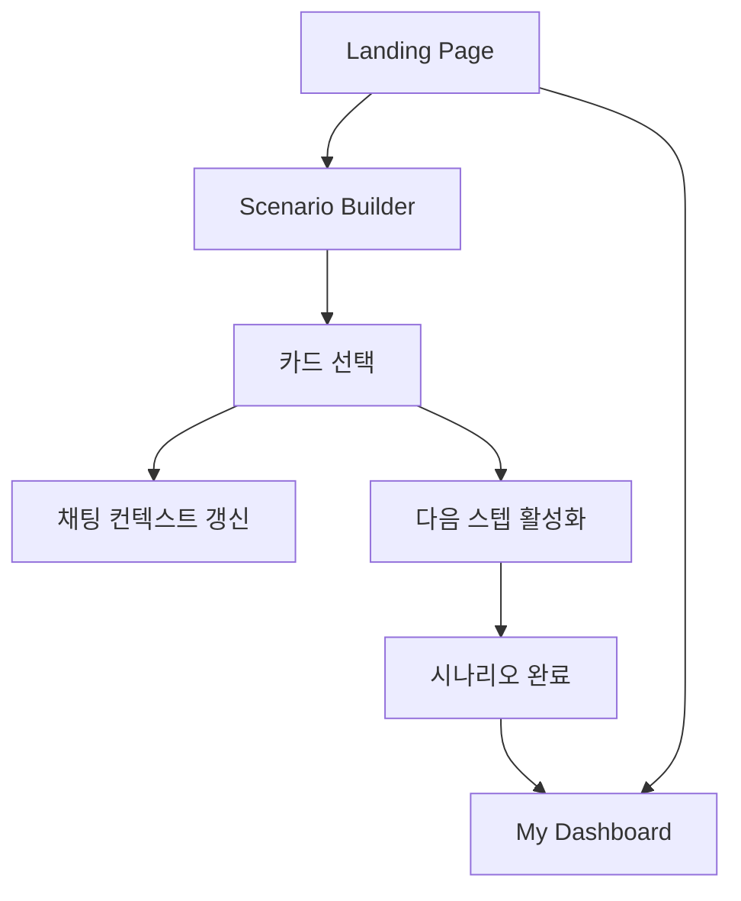
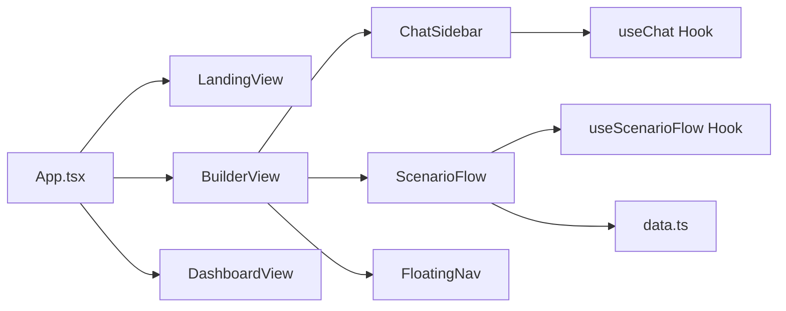

# 프론트엔드 아키텍처 (Frontend Architecture)

> **관련 문서**: [PRD.md](PRD.md) | [Functional_Specifications.md](Functional_Specifications.md) | [System_Flow_Architecture.md](System_Flow_Architecture.md)

---

## 1. 화면 구조

| View | 설명 |
|------|------|
| **Landing** | 서비스 소개 및 시작 CTA |
| **Builder** | 시나리오 빌더 (카드 선택 + AI 채팅) |
| **Dashboard** | 포트폴리오 및 논리 상태 모니터링 |

---

## 2. 디렉토리 구조

```
src/
├── App.tsx                 # View 라우팅
├── App.css                 # 스타일
├── data.ts                 # 시나리오 더미 데이터
├── components/
│   └── FloatingNav.tsx     # 하단 고정 네비게이션
├── views/
│   ├── LandingView.tsx
│   ├── BuilderView.tsx
│   └── DashboardView.tsx
└── features/
    ├── chat/               # AI 대화 기능
    │   ├── ChatSidebar.tsx
    │   ├── useChat.ts
    │   └── chatConfig.ts
    └── flow/               # 시나리오 플로우
        ├── ScenarioFlow.tsx
        ├── NewsTicker.tsx
        └── useScenarioFlow.ts
```

---

## 3. 화면 흐름도



---

## 4. 컴포넌트 관계도



---

## 5. 주요 기능

### 5.1 Builder (시나리오 플로우)
*   단계별 카드 선택 → 다음 단계 자동 활성화
*   선택 상태는 `selections` 객체로 관리
*   마지막 단계 완료 시 대시보드로 이동 가능

### 5.2 AI Chat (왼쪽 패널)
*   현재 선택된 카드 컨텍스트 기반 대화
*   OpenRouter API 직접 호출 (환경변수 사용)
*   "쉬운 설명" / "관련 뉴스 검색" 액션 제공

---

## 6. 백엔드 연동 포인트 (Future)

| 현재 | 향후 |
|------|------|
| OpenRouter 직접 호출 | `/api/chat` 프록시 API |
| Google 검색 새 탭 | `/api/search` 내부 API |
| 더미 데이터 `data.ts` | DB에서 시나리오 Fetch |
