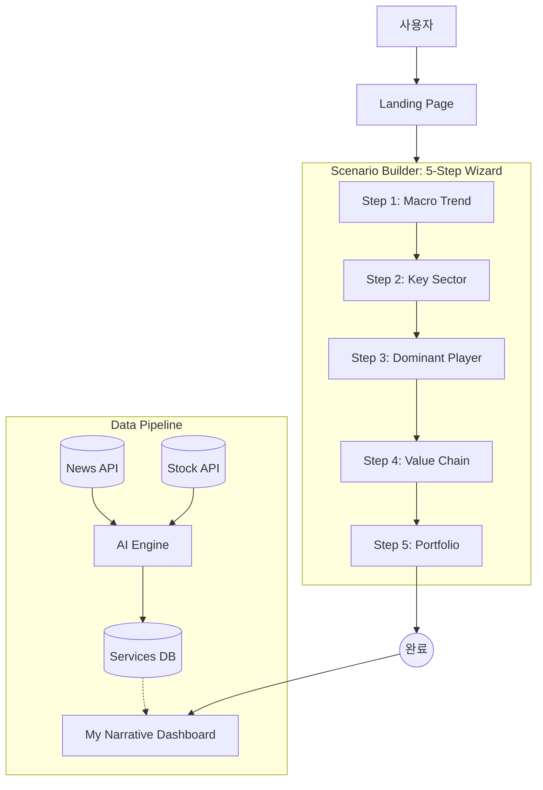

# 시나리오 흐름 설계 (Scenario Flow Architecture)

> **관련 문서**: [PRD.md](PRD.md) | [Functional_Specifications.md](Functional_Specifications.md) | [Frontend_Architecture.md](Frontend_Architecture.md) | [System_Flow_Architecture.md](System_Flow_Architecture.md)

---

## 1. 전체 프로세스 흐름도



---

## 2. 단계별 질문 로직 (5 Steps)

### Step 1: MACRO TREND (What big wave?)

> **Q1. 미래 3년을 좌우할 거대한 물결은 무엇입니까?**

**설명**: 큰 흐름을 먼저 정해야 나머지 선택이 흔들리지 않습니다. 시장의 방향이 시나리오의 뼈대가 됩니다.

| 선택지 ID | 타입 | 제목 | 확률 |
|----------|------|------|------|
| `ai_supercycle` | MAIN | AI 슈퍼사이클 | 90% |
| `edge_computing` | ALTERNATIVE | 온디바이스 AI | 65% |
| `geopolitics` | RISKY | 기술 패권 전쟁 | 40% |

---

### Step 2: KEY SECTOR (Which industry?)

> **Q2. 그 물결 속에서 가장 유망한 산업군은?**

**설명**: 산업군을 좁혀야 정보 과부하를 줄이고 확률을 높일 수 있습니다. 어떤 판에서 싸울지 정하는 단계입니다.

**필터링**: Step 1에서 선택한 Macro Trend의 `parentId`를 가진 옵션만 표시

| 상위 선택 | 하위 옵션 예시 |
|----------|--------------|
| AI 슈퍼사이클 | HBM & 차세대 메모리, AI 가속기, 전력 및 냉각 |
| 온디바이스 AI | IP & 디자인하우스, LPDDR & PIM, 경량화 모델 |
| 기술 패권 전쟁 | 파운드리 (USA), 레거시 반도체, 소버린 AI |

---

### Step 3: DOMINANT PLAYER (Who leads?)

> **Q3. 해당 섹터를 장악한 1등/주도 기업은?**

**설명**: 승자 후보를 고르지 않으면 전략이 흩어집니다. 실제로 리더가 누군지 명확히 해야 합니다.

| 섹터 예시 | 주도 기업 예시 |
|----------|--------------|
| HBM & 메모리 | SK하이닉스 (93%), 삼성전자 (55%) |
| AI 가속기 | 엔비디아 (96%), 브로드컴 (82%) |
| 전력 및 냉각 | 버티브 (88%), LS ELECTRIC (72%) |

---

### Step 4: VALUE CHAIN (Who benefits together?)

> **Q4. 1등 기업과 함께 성장할 핵심 파트너는?**

**설명**: 주도 기업 주변의 밸류체인을 보면 수익 레버리지가 생깁니다. 동반 성장 파트를 확정합니다.

| 주도 기업 | 밸류체인 파트너 예시 |
|---------|-------------------|
| SK하이닉스 | 한미반도체 (본딩), 에스티아이 (리플로우) |
| 삼성전자 | 하나마이크론 (패키징), 솔브레인 (소재) |
| 엔비디아 | TSMC 밸류체인, 유리기판 |
| 버티브 | 액침 냉각유 |

---

### Step 5: PORTFOLIO (Final pick?)

> **Q5. 최종적으로 어떤 종목을 매수하시겠습니까?**

**설명**: 최종 매수 종목을 정해 실행 가능성을 확보합니다. 여기서부터는 추적과 리밸런싱 단계입니다.

| 밸류체인 | 최종 매수 종목 예시 |
|---------|------------------|
| 한미반도체 (장비) | 한미반도체 042700.KS (92%) |
| 에스티아이 (장비) | 에스티아이 039440.KQ (78%) |
| 하나마이크론 (OSAT) | 하나마이크론 067310.KQ (70%) |
| 솔브레인 (소재) | 솔브레인 357780.KQ (75%) |

---

## 3. 옵션 필터링 로직

각 단계에서 표시되는 옵션은 **이전 단계의 선택에 따라 필터링**됩니다.

```typescript
// src/features/flow/useScenarioFlow.ts

const visibleOptionsByStep = (stepIndex: number) => {
  const step = ALL_STEPS[stepIndex]
  if (!step) return []
  
  // Step 1은 모든 옵션 표시
  if (stepIndex === 0) return step.options
  
  // Step 2~5는 이전 단계 선택의 parentId로 필터링
  const prevStepId = ALL_STEPS[stepIndex - 1].id
  const parentSelectionId = selections[prevStepId]
  return step.options.filter(
    (opt) => !opt.parentId || opt.parentId === parentSelectionId
  )
}
```

---

## 4. 옵션 타입 분류

| Type | 설명 | UI 스타일 |
|------|------|----------|
| `MAIN` | 메인 추천 (높은 확률) | 파란색 강조 |
| `ALTERNATIVE` | 대안 선택지 | 기본 스타일 |
| `RISKY` | 고위험/고수익 | 빨간색 경고 |

---

## 5. 확률 계산

```typescript
// 선택한 모든 옵션의 확률 평균
const currentProbability = useMemo(() => {
  const executedProbs: number[] = []
  ALL_STEPS.forEach((step) => {
    const selectedId = selections[step.id]
    if (selectedId) {
      const option = getOptionById(selectedId)
      if (option) executedProbs.push(option.probability)
    }
  })
  if (executedProbs.length === 0) return 0
  return Math.round(
    executedProbs.reduce((a, b) => a + b, 0) / executedProbs.length
  )
}, [selections])
```

---

## 6. 데이터 구조

### Option 타입

```typescript
export type Option = {
  id: string
  type: 'MAIN' | 'ALTERNATIVE' | 'RISKY'
  badge: string           // 카드 상단 태그
  title: string           // 제목
  subtitle: string        // 부제목
  probability: number     // 적중 확률 (0-100)
  desc: string            // 설명
  icon: string            // Material Icon 이름
  parentId?: string       // 상위 옵션 ID (필터링용)
  aiAnalysis: AIAnalysis  // AI 분석 정보
}
```

### AIAnalysis 타입

```typescript
export type AIAnalysis = {
  summary: string                    // 요약
  detail: string                     // 상세 설명
  easyTerm: string                   // 쉬운 설명
  disclosure?: DisclosureInfo        // 공시 정보
  chart?: ChartData[]                // 차트 데이터
  trend?: {                          // 트렌드
    label: string
    value: string
    direction: 'UP' | 'DOWN'
  }
}
```

---

## 7. 화면 컴포넌트 매핑

| 기능 | 컴포넌트 | 파일 |
|------|---------|------|
| 전체 빌더 뷰 | `BuilderView` | `src/views/BuilderView.tsx` |
| 시나리오 플로우 | `ScenarioFlow` | `src/features/flow/ScenarioFlow.tsx` |
| 플로우 상태 관리 | `useScenarioFlow` | `src/features/flow/useScenarioFlow.ts` |
| AI 채팅 사이드바 | `ChatSidebar` | `src/features/chat/ChatSidebar.tsx` |
| 뉴스 티커 | `NewsTicker` | `src/features/flow/NewsTicker.tsx` |
| 더미 데이터 | `ALL_STEPS` | `src/data.ts` |

---

*문서 작성일: 2026-01-27*  
*버전: 2.1 (코드 동기화)*
