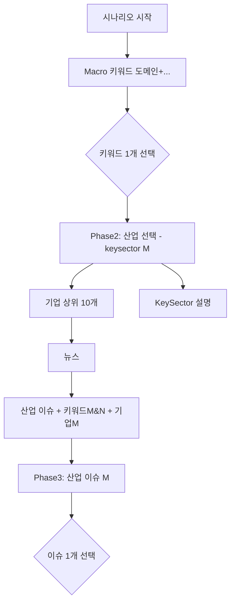
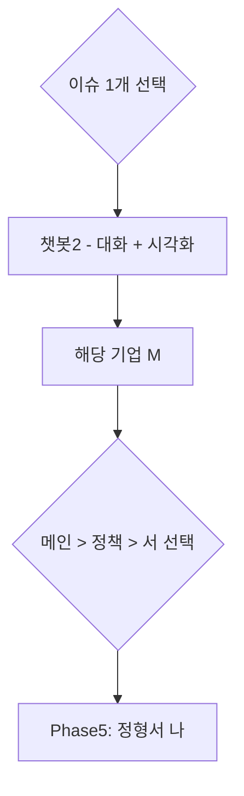
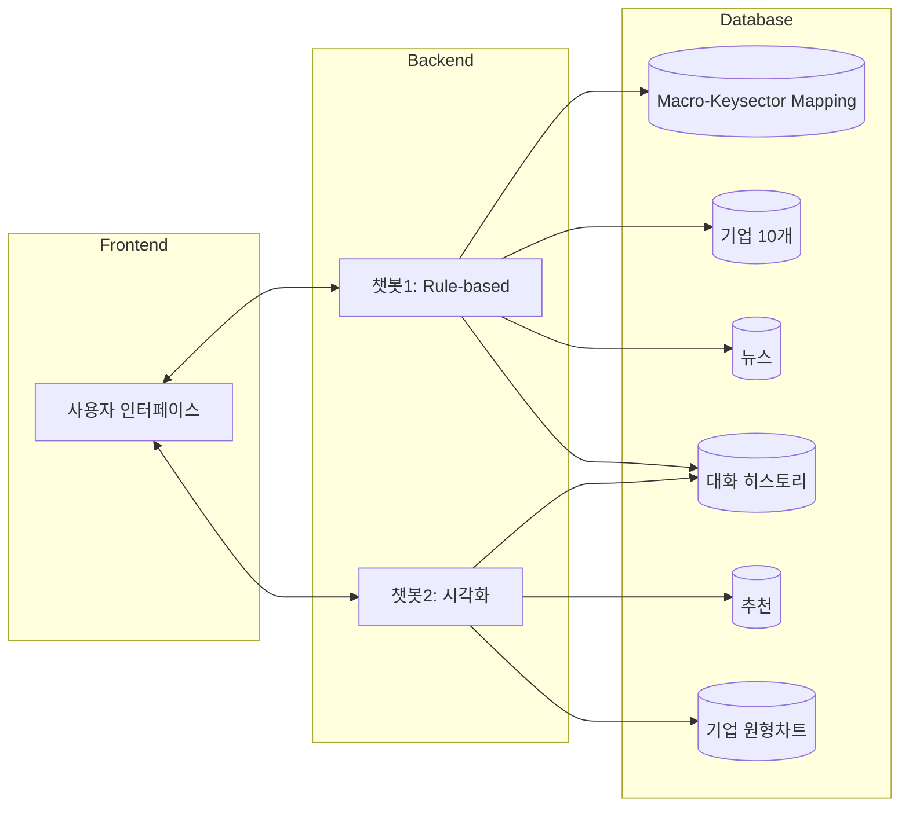
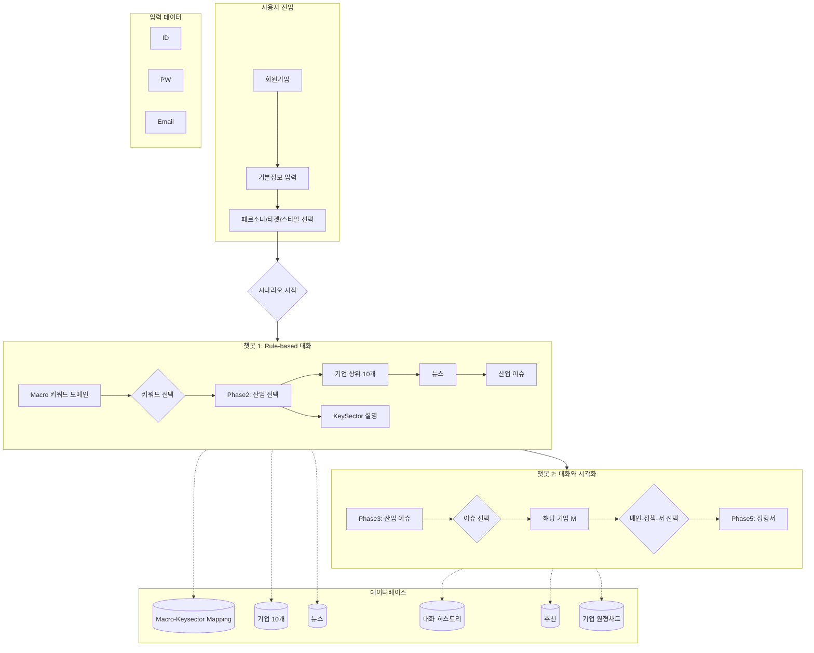

# 시스템 플로우 아키텍처 (System Flow Architecture)

> **관련 문서**: [PRD.md](PRD.md) | [Functional_Specifications.md](Functional_Specifications.md) | [Scenario_Flow_Architecture.md](Scenario_Flow_Architecture.md)

---

## 1. 개요

이 문서는 **"시나리오 생성 2"** 플로우의 전체 아키텍처를 설명합니다.
사용자가 회원가입 후 AI 챗봇과의 대화를 통해 **시나리오를 생성하고 시각화**하는 과정을 단계별로 정의합니다.

---

## 2. 사용자 흐름 (User Flow)

### 2.1 진입점 (Entry Point)

```
회원가입 → 기본정보 입력 → 페르소나/타겟/스타일 선택 → 시나리오 시작
```

| 단계 | 입력 항목 | 설명 |
|------|----------|------|
| 회원가입 | ID, PW, Email | 사용자 인증 정보 |
| 기본정보 | 투자 성향, 관심 분야 등 | 초기 프로파일링 |
| 선택 | 페르소나/타겟/스타일 | 시나리오 생성 방향 설정 |

---

## 3. 챗봇 기반 시나리오 생성 흐름

시스템은 **두 개의 챗봇 레이어**로 구성되어 있습니다:

### 3.1 챗봇 1 - 대화 기반 설명 (Rule-based)

> 사용자에게 거시 테마와 산업을 선택하게 유도하는 **규칙 기반 대화**



| Phase | 목적 | 사용자 액션 | 시스템 응답 |
|-------|------|------------|------------|
| **Phase 1** | Macro 키워드 탐색 | 키워드 도메인 확인 | 키워드 목록 제시 |
| **Phase 2** | 산업(Keysector) 선택 | 키워드 1개 선택 | 상위 10개 기업 + 뉴스 제공 |
| **Phase 3** | 산업 이슈 확인 | 이슈 1개 선택 | 상세 이슈 분석 |

### 3.2 챗봇 2 - 대화 + 시각화

> 선택된 기업을 기반으로 **대화형 시각화**를 제공



| Phase | 목적 | 사용자 액션 | 시스템 응답 |
|-------|------|------------|------------|
| **Phase 4** | 기업 상세 분석 | 기업 선택 확인 | 시각화 데이터 제공 |
| **Phase 5** | 정형 보고서 생성 | 메인/정책/서 선택 | 최종 시나리오 문서 |

---

## 4. 데이터베이스 구조

### 4.1 DB 구성

| 데이터베이스 | 용도 | 연결 Phase |
|-------------|------|-----------|
| **Macro-keysector Mapping (DB)** | Macro 키워드와 Keysector 간의 매핑 정보 | Phase 1-2 |
| **기업 10개** | 산업별 상위 10개 기업 데이터 | Phase 2 |
| **뉴스** | 산업/기업별 관련 뉴스 | Phase 2-3 |
| **영상 1 대화 히스토리** | 챗봇 대화 기록 저장 | 전체 |
| **추천** | 사용자 맞춤 추천 데이터 | Phase 4-5 |
| **기업 - 원형차** (원형 차트 데이터) | 기업 분석 시각화 데이터 | Phase 4-5 |

### 4.2 데이터 흐름



---

## 5. 비즈니스 로직 매핑

### 5.1 프론트엔드 ↔ 비즈니스 로직

| 현재 구현 (src/) | 비즈니스 로직 | 플로우 단계 |
|-----------------|-------------|------------|
| `LandingView.tsx` | 서비스 소개, 회원가입 유도 | 진입점 |
| `BuilderView.tsx` | 시나리오 생성 인터페이스 | 전체 Phase |
| `DashboardView.tsx` | 완성된 시나리오 모니터링 | Phase 5 이후 |
| `features/chat/` | 챗봇 1, 2 대화 처리 | 전 Phase |
| `features/flow/` | 단계별 플로우 관리 | 전 Phase |

### 5.2 백엔드 필요 기능 (미구현)

| 기능 | 설명 | 우선순위 |
|------|------|---------|
| **Macro-Keysector API** | 키워드-산업 매핑 조회 | 🔴 High |
| **기업 Top 10 API** | 산업별 상위 기업 조회 | 🔴 High |
| **뉴스 API** | 산업/기업별 뉴스 조회 | 🔴 High |
| **대화 히스토리 API** | 채팅 기록 저장/조회 | 🟡 Medium |
| **추천 API** | 사용자 맞춤 추천 | 🟡 Medium |
| **시각화 데이터 API** | 원형 차트 등 시각화 | 🟢 Low |

---

## 6. 전체 아키텍처 다이어그램



---

## 7. 추가 고려 사항

### 7.1 현재 구현 vs 플로우 차트 Gap 분석

| 플로우 차트 요소 | 현재 구현 상태 | 필요 작업 |
|----------------|--------------|----------|
| 회원가입/로그인 | ❌ 미구현 | 인증 시스템 구축 |
| 페르소나/타겟/스타일 선택 | ⚠️ 부분 구현 | `BuilderView` 확장 |
| Macro-Keysector Mapping | ❌ 미구현 | DB 스키마 설계 + API |
| 기업 Top 10 조회 | ❌ 미구현 | 외부 데이터 소싱 |
| 뉴스 연동 | ⚠️ 더미 데이터 | 네이버 뉴스 API 연동 |
| 대화 히스토리 저장 | ❌ 미구현 | DB + API 구축 |
| 시각화 (원형 차트 등) | ⚠️ 부분 구현 | 차트 라이브러리 통합 |

### 7.2 기술 스택 제안

| 레이어 | 현재 | 제안 |
|-------|------|------|
| **Frontend** | React + TypeScript + Vite | 유지 |
| **Backend** | (없음) | FastAPI / Next.js API Routes |
| **Database** | (없음) | PostgreSQL + Prisma |
| **AI/LLM** | OpenRouter API | 유지 + 프롬프트 최적화 |
| **Cache** | (없음) | Redis (대화 세션 관리) |

### 7.3 다음 단계 우선순위

1. **🔴 High**: 백엔드 API 서버 구축 (`/backend` 디렉토리 활용)
2. **🔴 High**: Macro-Keysector Mapping DB 설계 및 구현
3. **🟡 Medium**: 뉴스 API 연동 (네이버 뉴스 / BigKinds)
4. **🟡 Medium**: 대화 히스토리 저장 기능
5. **🟢 Low**: 시각화 컴포넌트 고도화

---

## 8. 참고 자료

- [PRD.md](PRD.md) - 제품 요구사항 정의
- [Functional_Specifications.md](Functional_Specifications.md) - 기능 명세
- [Scenario_Flow_Architecture.md](Scenario_Flow_Architecture.md) - 시나리오 5단계 플로우
- [Frontend_Architecture.md](Frontend_Architecture.md) - 프론트엔드 구조

---

*문서 작성일: 2026-01-27*  
*버전: 2.0*
