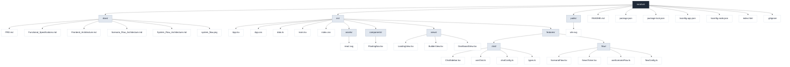

# Directory_Structure

This diagram visualizes the repository structure. Excludes: .git, node_modules, dist, dist-ssr, .venv, __pycache__, .env*, logs, editor metadata.

```mermaid
%%{init: {'theme':'neutral','flowchart':{'curve':'basis'}}}%%
flowchart TD
  Root["narative/"]:::root
  Root --> Docs["docs/"]:::dir
  Root --> Src["src/"]:::dir
  Root --> Public["public/"]:::dir
  Root --> Readme["README.md"]:::file
  Root --> Package["package.json"]:::file
  Root --> PackageLock["package-lock.json"]:::file
  Root --> TsApp["tsconfig.app.json"]:::file
  Root --> TsNode["tsconfig.node.json"]:::file
  Root --> IndexHtml["index.html"]:::file
  Root --> Gitignore[".gitignore"]:::file

  Docs --> PRD["PRD.md"]:::file
  Docs --> Functional["Functional_Specifications.md"]:::file
  Docs --> FrontendArch["Frontend_Architecture.md"]:::file
  Docs --> ScenarioArch["Scenario_Flow_Architecture.md"]:::file
  Docs --> SystemArch["System_Flow_Architecture.md"]:::file
  Docs --> SystemPng["system_flow.png"]:::file

  Src --> AppTsx["App.tsx"]:::file
  Src --> AppCss["App.css"]:::file
  Src --> DataTs["data.ts"]:::file
  Src --> MainTsx["main.tsx"]:::file
  Src --> IndexCss["index.css"]:::file
  Src --> Assets["assets/"]:::dir
  Assets --> ReactSvg["react.svg"]:::file

  Src --> Components["components/"]:::dir
  Components --> FloatingNav["FloatingNav.tsx"]:::file

  Src --> Views["views/"]:::dir
  Views --> Landing["LandingView.tsx"]:::file
  Views --> Builder["BuilderView.tsx"]:::file
  Views --> Dashboard["DashboardView.tsx"]:::file

  Src --> Features["features/"]:::dir
  Features --> Chat["chat/"]:::dir
  Chat --> ChatSidebar["ChatSidebar.tsx"]:::file
  Chat --> UseChat["useChat.ts"]:::file
  Chat --> ChatConfig["chatConfig.ts"]:::file
  Chat --> ChatTypes["types.ts"]:::file

  Features --> Flow["flow/"]:::dir
  Flow --> ScenarioFlow["ScenarioFlow.tsx"]:::file
  Flow --> NewsTicker["NewsTicker.tsx"]:::file
  Flow --> UseScenario["useScenarioFlow.ts"]:::file
  Flow --> FlowConfig["flowConfig.ts"]:::file

  Public --> ViteSvg["vite.svg"]:::file

  classDef root fill:#1f2937,stroke:#111827,color:#f9fafb;
  classDef dir fill:#e2e8f0,stroke:#94a3b8,color:#0f172a;
  classDef file fill:#ffffff,stroke:#cbd5e1,color:#0f172a;
```
